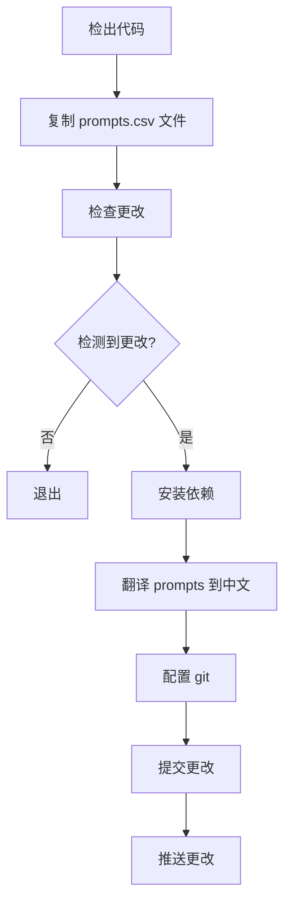

<h1 align="center">Welcome to awesome-chatgpt-prompts-zh 👋</h1>
<!--  -->

根据 awesome-chatgpt-prompts 仓库的 prompts.csv , 翻译成中文的 prompts-zh.json。

## 🛠️ 依赖

- 😄 [awesome-chatgpt-prompts](https://github.com/f/awesome-chatgpt-prompts) chatGPT 提示词
- 📦 [openAI](https://openai.com/) 翻译

## 🤖️ 在 [ChatGPT](https://github.com/lencx/ChatGPT) 桌面应用程序添加 prompts

## 📝 流程图

Give a ⭐️ if this project helped you!

---

_This README was generated with ❤️ by [readme-md-generator](https://github.com/kefranabg/readme-md-generator)_
